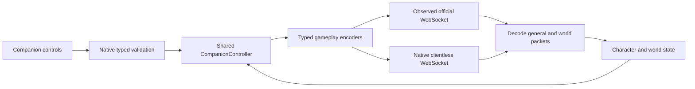

# Rayrag client protocol reference

Use this guide to find a packet, understand its current codec, and implement a feature through the existing Companion controller. The scan covers every entry in the pinned client packet enum, every Companion gameplay codec, and both connection modes. It does not claim a complete reverse engineering of the deployed server.

| Read | Purpose |
| --- | --- |
| [Packet catalogue](packets.md) | All 113 pinned IDs (0–112), Companion direction coverage, and source-only gaps. |
| [Wire formats](wire-formats.md) | Field order, scalar encoding, nested records, incoming/outgoing differences, and parser limits for implemented packets. |
| [Source-only packets](upstream-packets.md) | Pinned upstream handlers for packets without a Companion adapter; starting points for future features. |
| [Historical protocol evidence](../PROTOCOL.md) | Deployed observations, asset provenance, feature-specific evidence and limitations. |
| [Feature inventory](../FEATURES.md) | Product capabilities and remaining work; packet coverage alone does not establish a usable feature. |

## Compatibility and evidence

Documentation scan: **2026-10-06**, Companion source **`4f542461077713ea351169ee372f8b665a41d463`**. The packet names and numeric order come from [Rebuild PacketType.cs at `4099e2c000c3c550516760b9c1241595aac9aceb`](https://github.com/Doddler/RagnarokRebuildTcp/blob/4099e2c000c3c550516760b9c1241595aac9aceb/RoRebuildServer/RebuildSharedData/Networking/PacketType.cs). Resolve subsequent implementation changes against the linked local owners; this is a reference snapshot.

The configured compatibility contract is version **8**, build **`Build_2569-09-01-01-55`**, official page **`https://websea01.rayrag.com/`**, socket **`wss://gamesea01.rayrag.com/ws`**. These values are enforced in [protocol.ts](../../src/protocol.ts), [direct.rs](../../src-tauri/src/direct.rs) and [direct_wire.rs](../../src-tauri/src/direct_wire.rs). This scan made no authenticated connection and sent no gameplay packets. Historical live checks are dated in the evidence documents; they are not fresh runtime proof.

Evidence precedence is deployed evidence for the exact field/build, current Companion implementation for its accepted/emitted subset, then the pinned upstream contract. In particular, deployed **101** has an extra opaque header byte; 101 and 102 have precisely bounded optional opaque suffixes. Those exceptions are in [the party layout](wire-formats.md#party). A version number or upstream enum match does not prove the rest of the wire layout. Current upstream has reordered IDs; do not copy its numeric values into this client.

## Connection and initialization



**With game client:** [bridge.ts](../../src/bridge.ts) observes the official WebSocket at the fixed origin/root path and exact socket URL. [login.ts](../../src/login.ts) hands credentials to active Unity login objects, calls `AttemptLogin`, reads occupied slots, and selects one through `SetCharacterInfo`/`ClickOk`. The official client constructs authentication. Login phases have 30-second deadlines; selection waits for 200 ms of stable readiness. Companion sends use the original socket implementation, while official sends are observed for action ownership and initialization.

**Bot only:** [direct.rs](../../src-tauri/src/direct.rs) verifies the public version file and bounded official HTML as inert text, with ordinary TLS validation, no redirects, a 10-second HTTP timeout and the `Rayrag-Companion` user agent. It opens the fixed TLS socket with a 15-second connection timeout. Rust owns credentials, authentication, approval and character selection; approval bodies and tokens never reach the JavaScript runtime. [Connection modes](../CONNECTION_MODES.md) describes native ownership, maintenance and mode-switch rules.

The native initial sequence is:

1. Send authentication: `i16 version=8`, three literal zero bytes, username and password as .NET BinaryWriter strings (7-bit unsigned UTF-8 byte length, then bytes). **Authentication has no gameplay opcode and does not use gameplay `str`.** See `direct_wire::authentication`.
2. Receive **0 ConnectionApproved**: `b tokenPresent`; if true, `i32 tokenLength + opaque bytes`; `i32 characterCount`; for each character, `str name, i32 slot, str map, i32 summaryLength, summary bytes`. Fields after the first bit remain unaligned. Native bounds: packet ≤16,384 bytes, token ≤4,096 bytes, ≤3 characters, distinct slots 0–2, strings ≤256 bytes, nonempty/control-free names, summary ≤256 bytes and divisible by four, and no complete trailing byte. Approval parser integers are nonnegative where used as lengths/counts. **1** or **32** before approval rejects login; unexpected pre-approval packets fail. Approval has a 60-second deadline.
3. Send **3 EnterServer**: `b false, str selectedServerProvidedName`. The chosen slot must exist. Native emits `enterSent` only after the socket write succeeds.
4. [direct-runtime.ts](../../src/direct-runtime.ts) processes server **3**, then requires the first **56** to contain full stats, skills and inventory, plus complete **94** memo data, before sending **2 PlayerReady** (opcode only). A processed map change **18** also sends one Ready. `readySent` means the write completed. Clearing resource uncertainty additionally needs matching own entry and unchanged resource revisions; Ready alone is insufficient.
5. Native sends application **4 Ping** (opcode only) every five seconds, including character selection and in-world Stop. WebSocket Ping/Pong are separate control frames. Maintenance can suppress new sends, including application Ping.

The local runtime processes `opened`, `enterSent`, `frame`, `readySent`, `closed`, and `failed` events serially. `opened` follows successful authentication write. In-world Stop ends automation while preserving receipt observation; pre-world Stop cancels the direct transport. Disconnect, runtime destruction and window closure retire it. Switching the visible Game/Bot view preserves the existing official connection.

Native transport bounds are distinct from codec bounds: 512 KiB socket messages/frames, 64 queued events / 4 MiB, 16 events per poll and 16 outgoing channel entries. Reads pause before queue capacity is exhausted; writes and cancellation remain available. Delivered batches remain owned until `direct_observed` acknowledges application. `direct_send` accepts 1–65,536 bytes and rejects first-byte 0/1/3/32, while checking webview/session/connection/maintenance ownership. **It is not a complete gameplay opcode validator.** Panel commands use the typed native validation boundary.

## Code ownership

| Boundary | Owner | Responsibility |
| --- | --- | --- |
| Primitive encoding | [binary.ts](../../src/binary.ts) | Bit stream, integer/float/string bounds and final-bit handling. |
| General dispatch and field entities | [protocol.ts](../../src/protocol.ts) | Core movement/combat/entity packets and adapters below. |
| Character state and skills | [protocol-feature.ts](../../src/protocol-feature.ts), [character-state.ts](../../src/character-state.ts) | Stats, inventory, casts, resource deltas and typed feature actions. |
| World interactions | [world-protocol.ts](../../src/world-protocol.ts), [world-state.ts](../../src/world-state.ts) | NPCs, shops, storage, cart, party and vending. |
| Manual adapters | [social](../../src/social-protocol.ts), [memo](../../src/memo-protocol.ts), [socket](../../src/socket-protocol.ts), [refine](../../src/refine-protocol.ts), [warp](../../src/warp-protocol.ts), [Database travel](../../src/database-travel-protocol.ts) | Narrow request schemas and specialized observations. |
| Encoder composition | [controller-wire.ts](../../src/controller-wire.ts) | Routes typed controller actions to their wire encoders in both modes. |
| Action ownership | [controller.ts](../../src/controller.ts), [official-input.ts](../../src/official-input.ts) | Scheduling, state application, official-input coexistence, receipts, cancellation and uncertainty. |
| Native panel boundary | [control.rs](../../src-tauri/src/control.rs), [lib.rs](../../src-tauri/src/lib.rs) | Validate panel requests and authorize their webview/action family. |
| Transport | [bridge.ts](../../src/bridge.ts), [direct-runtime.ts](../../src/direct-runtime.ts), [direct.rs](../../src-tauri/src/direct.rs), [direct_wire.rs](../../src-tauri/src/direct_wire.rs) | Official observation and native clientless authentication, queues and lifecycle. |

`protocol.decode` tries memo notifications, character features, social, Warp, memo, then core packets. `CompanionController.receive` decodes both general and world owners before applying either result. An invalid owned packet cannot partly update the world. Unknown opcodes produce no event; that does not establish their payload is valid. Old connection generations are ignored. Official decode failures stop processing for that socket; clientless decode failures terminally disconnect.

## Implementing another feature

1. Find the opcode in the [catalogue](packets.md). Establish both directions separately, exact subtype/field order, bit alignment, lengths, optional branches and trailer behavior. If only upstream evidence exists, verify deployment compatibility before treating it as supported. Keep opaque fields opaque.
2. Add a typed action, strict validator and encoder in the owning adapter. Register receive decoding and event types in `decode` or `decodeWorld`, then apply them in the owning state object. Preserve absent/unknown state separately from observed empty/zero.
3. Route the encoder through `controller-wire.ts`. Give the controller one action owner and an authoritative result receipt. A socket write, visual effect or resource debit alone may not establish completion. Define late-response, Stop, map-change, disconnect and reconnect behavior before enabling retries.
4. Add native request validation in `control.rs`; new panel action families may also require `lib.rs::control_bot` and both runtime APIs. Review `official-input.ts` when official input can supersede a route or spend resources. Keep raw packets out of user/imported action schemas.
5. Add fixed synthetic wire fixtures and malformed/truncated/trailing-byte cases, including nonzero unused bits, actor zero, absent state and relevant int32 limits. Cover result correlation, stale generations, rejected writes and unresolved outcomes through both connection modes. Test sensitive auth only with synthetic accounts/local servers.
6. Run focused tests, then the repository's shared `npm run check` for an implementation change. `npm run bridge` regenerates the injected bridge through [build-bridge.mjs](../../scripts/build-bridge.mjs); edit TypeScript owners, not generated JavaScript. Native/package and hosted checks are separate proof surfaces.
7. Update this catalogue, the affected layout, [feature inventory](../FEATURES.md) and feature evidence together. Record the source/build and precisely which live actions were tested. An upstream handler, codec fixture, passing CI and deployed success are different evidence.

For a codec change, start with the relevant files below and add the affected controller/transport tests:

```sh
npm test -- src/binary.test.ts src/protocol.test.ts src/protocol-feature.test.ts src/world-protocol.test.ts
npm test -- src/login.test.ts src/direct-runtime.test.ts src/bridge-input.test.ts
```

Specialized fixtures live beside their adapters, including `actor-resource-protocol`, `party-engagement-protocol`, `social-protocol`, `memo-protocol`, `refine-protocol` and `warp-protocol` tests. Native `direct_wire.rs` and `direct.rs` tests exercise synthetic authentication and a local WebSocket server; no real account is required.
